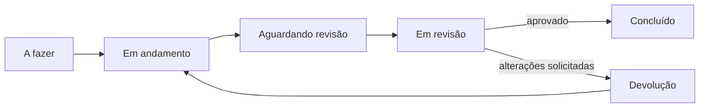
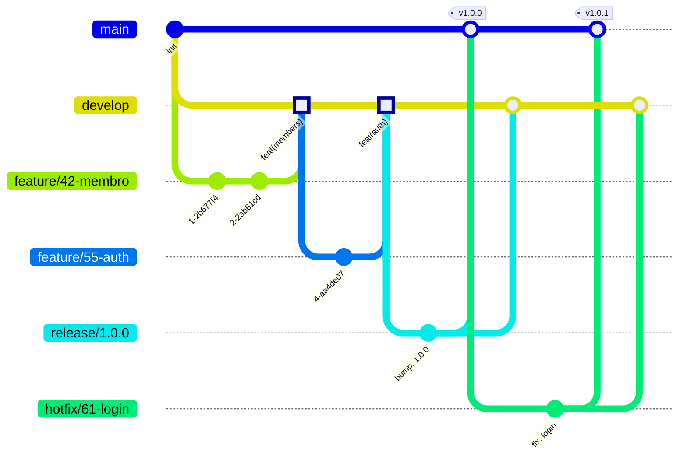

# Contribuindo com a puccomp-api

Este guia define o fluxo de trabalho, padrões de código e convenções do projeto. É direcionado aos membros do squad — leia antes de abrir sua primeira PR.

## Board

Cada tarefa no [GH Projects](https://github.com/orgs/puccomp/projects/9) passa pelo seguinte fluxo:



> Nem todo card é código — pode ser pesquisa, tarefa comercial, documentação, etc. O fluxo é o mesmo.

Movimentação é manual.

O título do card deve ser descritivo e em linguagem natural — não use prefixos de commit.

| O quê | Exemplo |
|---|---|
| Card | `Endpoint de criação de membro` |
| Branch | `feature/42-endpoint-criacao-membro` |
| Commits | `feat(members): adiciona endpoint de criação` |
| PR title | `feat(members): adiciona endpoint de criação` |

## Branches

Usamos [Git Flow](https://nvie.com/posts/a-successful-git-branching-model/).



| Branch | Formato | Base | Destino |
|---|---|---|---|
| `feature/*` | `feature/123-descricao-curta` | `develop` | `develop` |
| `bugfix/*` | `bugfix/123-descricao-curta` | `develop` | `develop` |
| `hotfix/*` | `hotfix/123-descricao-curta` | `main` | `main` + `develop` |
| `release/*` | `release/1.2.0` | `develop` | `main` + `develop` |

O número é o ID do card no GH Projects.

## Commits

Seguimos [Conventional Commits](https://www.conventionalcommits.org/) **em português**.

```
<tipo>(<escopo opcional>): <descrição curta no imperativo>
```

**Tipos:** `feat` `fix` `docs` `test` `refactor` `chore` `perf` `ci` `revert` `build`

```bash
# bom
feat(auth): adiciona autenticação via JWT
fix(financeiro): corrige cálculo de inadimplência
docs: atualiza guia de configuração do ambiente
refactor: extrai validação de CPF para utilitário

# ruim
fix: ajustes
feat: coisas do auth
WIP: terminando
update
```

> **Este repositório será público.** O histórico de commits é visto por pessoa de fora da EJ — mensagens desleixadas refletem na imagem que deixamos como organização.

## Bruno

A collection fica em `bruno/`. Use o [Bruno](https://www.usebruno.com/) para explorar e testar a API localmente.

```
bruno/
├── environments/
│   ├── local.bru          # commitado — aponta para localhost
│   └── local.secrets.bru  # ignorado pelo git — credenciais reais
└── membros/
    └── ...
```

Copie `local.bru` como `local.secrets.bru` e preencha os segredos necessários. Nunca commite o `.secrets.bru`.

> PR que adiciona ou altera um endpoint deve atualizar a coleção Bruno correspondente.

## Pull Requests

1. PR aponta para `develop` (ou `main` em hotfixes)
2. Mínimo **1 aprovação** para mergear
3. Merge via **squash** — todos os commits da branch viram 1 no destino
4. Merge feito preferencialmente pelo techlead, mas qualquer aprovador pode mergear se necessário
5. Ao abrir o PR, mova o card para **Aguardando revisão**

## Padrões de Código

### Idioma

A regra é simples: **tudo que é estrutura é inglês; tudo que é prosa para humano é português.**

| O quê | Idioma | Formato |
|---|---|---|
| Classes, métodos, variáveis | Inglês | `camelCase` |
| Entidades e colunas do banco | Inglês | `snake_case` |
| Campos JSON (chaves de request/response) | Inglês | `snake_case` |
| Endpoints | Inglês | `/v1/members`, `/v1/roles` |
| Valor das mensagens de erro | Português | `"Membro não encontrado"` |
| Valor de enum | Inglês | `OWNER`, `ACTIVE` |
| Label de exibição de enum | Português | `"Dono"`, `"Ativo"` |
| Comentários, Javadoc, documentação OAS | Português | — |

O Jackson e o Hibernate estão configurados para `snake_case` automaticamente — um campo Java `createdAt` vira `created_at` no JSON e no banco sem anotação manual.


### Legibilidade

Nomes revelam intenção — um bom nome elimina a necessidade do comentário.

```java
// ruim
int d; // dias desde criação
List<Member> list2; // membros ativos

// bom
int daysSinceCreated;
List<Member> activeMembers;
```

Bom senso acima de dogma: Clean Code é referência, não lei. Não quebre uma abstração útil para satisfazer uma regra.

### Arquitetura

O projeto é um **Monólito Modular**: uma única aplicação dividida em módulos por **capacidade de negócio** — não por entidade nem por camada técnica.

O teste para saber se um módulo está bem desenhado: **"consigo explicar esse módulo sem mencionar os outros?"** Se `members`, `departments` e `roles` só fazem sentido juntos (um membro tem cargo e departamento), eles são **um módulo só** (`organization`). Separar por entidade é o erro clássico — gera acoplamento espalhado. Módulos que quase nunca conversam (ex.: `recruitment`) são bom sinal, não problema.

```
com.puccomp.api
├── organization/        ← módulo: estrutura da EJ
│   ├── members/
│   ├── departments/
│   └── roles/
├── recruitment/         ← módulo: candidaturas, currículos
├── shared/              ← transversal: auditoria, referência, exceções, texto
└── config/              ← transversal: configuração de infra
```

**Fronteira no módulo, não na entidade.** Dentro de um módulo, os tipos colaboram à vontade — `Member` segurar `@ManyToOne Role` é detalhe interno de `organization`, não cruza fronteira. **Entre** módulos, só se acessa o que o outro **publica** (API/DTO/evento), nunca o interno. É a diferença entre entrar pela porta da frente e pular a janela.

**Visibilidade dentro do módulo.** Público apenas o que é contrato: `controller` (porta de entrada) e DTOs de request/response. Implementação — `service`, `repository` — é *package-private*.

**Spring Modulith valida isso.** `ModularityTests.verify()` quebra o build se um módulo acessar o interno de outro, e gera diagramas dos módulos em `build/spring-modulith-docs`. `shared` e `config` são módulos `OPEN` (transversais, sem encapsulamento — todos podem usar). Ex.: `Standing` vive em `shared/reference/` por ser usado por mais de um módulo; `MemberStatus` é exclusivo de membros e fica em `organization/members/`.

### Java

- Java 25 — use os recursos modernos: records, sealed classes, pattern matching, text blocks, streams
- Prefira imutabilidade e código expressivo

### Lombok

Use `record` para DTOs e objetos de resposta. Lombok é para entidades JPA (que não podem ser records).

```java
@Entity
@Getter
@Builder
@NoArgsConstructor(access = AccessLevel.PROTECTED)
@AllArgsConstructor(access = AccessLevel.PRIVATE)
public class Member { ... }
```

> Nunca use `@Data` em entidades — gera `equals`/`hashCode` problemáticos e abre setters públicos para tudo.

### Testes

Testes não são obrigatórios em toda PR, mas quando escritos devem cobrir **lógica de negócio real**.

```java
// não escreva isso
@Test
@DisplayName("deve criar membro")
void shouldCreateMember() {
    var membro = new Membro("Ana");
    assertNotNull(membro); // não testa nada
}

// escreva isso
@Test
@DisplayName("deve calcular multa por inadimplência")
void shouldCalculateLatePaymentFee() {
    // lógica que pode quebrar e tem valor em garantir
}
```

Método em inglês (segue a regra do projeto), `@DisplayName` em português (legível no relatório de testes).

> Com IA é trivial gerar testes que não testam nada. Não polua o repositório com isso.

## Ambiente Local

A infra sobe via `docker compose` e a API via Gradle wrapper. O perfil `dev` é o ativo por padrão e o `application-dev.yaml` já traz datasource, mail, segredo JWT e URL de onboarding — **localmente você não precisa de nenhuma variável de ambiente**.

**Pré-requisitos:** Docker e JDK 25 (o `./gradlew` cuida do resto).

```bash
docker compose up -d      # postgres + mailpit
./gradlew bootRun         # sobe a API no perfil dev
```

No primeiro boot com o banco vazio, o `DevDataSeeder` cria a EJ `ej-comp` e duas contas de teste:

| Conta | Email | Senha | Standing | Cargo |
|---|---|---|---|---|
| Dono | `dono@ejcomp.dev` | `dono123` | `OWNER` | Presidente |
| Membro | `membro@ejcomp.dev` | `membro123` | `STAFF` | — |

**Serviços e portas:**

| Serviço | URL | Observação |
|---|---|---|
| API | http://localhost:8080 | — |
| Swagger UI | http://localhost:8080/docs | contrato OpenAPI |
| Postgres | `localhost:5432` | db/user/senha: `puccomp` |
| Mailpit (SMTP) | `localhost:1025` | recebe os emails de convite |
| Mailpit (UI) | http://localhost:8025 | leia aqui o token `inv_...` do convite |

**Observabilidade (opt-in):**

```bash
docker compose -f compose.observability.yml up -d   # prometheus + grafana
```

| Serviço | URL | Login |
|---|---|---|
| Prometheus | http://localhost:9090 | — |
| Grafana | http://localhost:3000 | `admin` / `admin` |

As métricas da app ficam em `/actuator/prometheus`.

**Testes:** `./gradlew test` sobe um Postgres real via Testcontainers — só precisa do Docker rodando.
