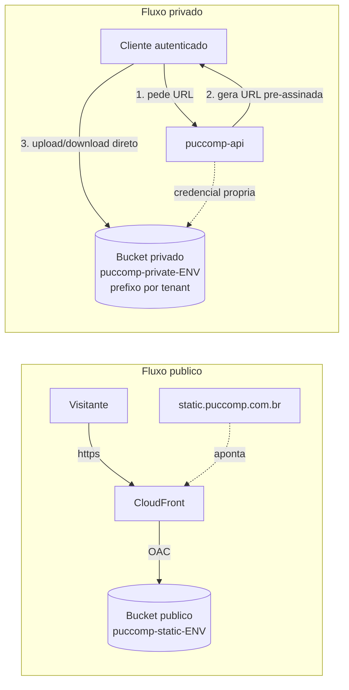

# Armazenamento de arquivos (S3)

Referência de implementação da arquitetura de armazenamento. O **porquê** das escolhas está
no [ADR 0002](../adr/0002-armazenamento-s3.md); aqui ficam os detalhes concretos.

> Os quatro buckets já existem na conta, em `sa-east-1`, com Block Public Access completo,
> SSE-S3 (AES256) e versionamento ligado nos privados (verificado em 2026-09-05). O que ainda
> não existe é o IAM próprio da aplicação, o CloudFront/DNS e o lifecycle (ver abaixo).

> A API agora implementa armazenamento privado de currículos no módulo `files`.
> O upload inicial passa pela API para validação e antivírus; download usa URL pré-assinada.
> Veja [arquivos](arquivos.md) e [ADR 0004](../adr/0004-curriculos-privados.md).

## Visão geral



- **Público:** o objeto fica em um bucket fechado; o CloudFront é a única forma de ler; o
  domínio `static.puccomp.com.br` aponta para a distribuição.
- **Privado:** o cliente nunca acessa o bucket direto; a API gera uma URL pré-assinada de
  curta duração para um objeto específico, e o cliente sobe ou baixa direto no S3.

## Estrutura de buckets

- **Região:** `sa-east-1` (São Paulo).
- **Ambientes separados:** um conjunto de buckets por ambiente (dev e prod).

| Ambiente | Bucket público        | Bucket privado         |
|----------|-----------------------|------------------------|
| prod     | `puccomp-static-prod` | `puccomp-private-prod` |
| dev      | `puccomp-static-dev`  | `puccomp-private-dev`  |

Layout de chaves (exemplos):

- Público: `projetos/{projectSlug}/{assetId}.png`
- Privado: `{tenantId}/{tipo}/{uuid}.{ext}` (ex.: `a1b2.../files/9f8e....pdf`, layout que o
  módulo `files` já grava). O nome enviado pelo usuário nunca entra na chave: fica só nos
  metadados e volta no `Content-Disposition` da URL pré-assinada.

## Configurações recomendadas dos buckets

- **Block Public Access: ligado** nos dois tipos de bucket. O bucket público continua
  fechado; o CloudFront lê via OAC por uma bucket policy específica (ver seção CloudFront),
  o que não é acesso público e convive com o Block Public Access ligado.
- **Criptografia em repouso:** SSE-S3 (AES-256), padrão e sem custo. Alternativa SSE-KMS, se
  no futuro precisarmos de controle de chave e auditoria por chave.
- **Versionamento:** ligado no **bucket privado** (recuperar exclusões acidentais).
- **CORS:** necessário nos buckets que recebem upload do navegador via URL pré-assinada.
  Liberar apenas as origens do front-end:

  ```json
  [
    {
      "AllowedOrigins": ["https://app.puccomp.com.br"],
      "AllowedMethods": ["GET", "PUT", "HEAD"],
      "AllowedHeaders": ["*"],
      "ExposeHeaders": ["ETag"],
      "MaxAgeSeconds": 3000
    }
  ]
  ```

  (As origens exatas do front-end são um item a confirmar.)
- **Validade das URLs pré-assinadas:** curta, sugestão de 5 a 15 minutos.
- **Ciclo de vida:** obrigatório no bucket privado. Com versionamento ligado, o DELETE que a
  limpeza de reservas faz só cria um marcador: sem lifecycle os bytes do currículo ficam no
  bucket para sempre, pagos e ainda recuperáveis. Nunca expire a versão **atual** — a retenção
  das candidaturas é decisão de negócio, não de infraestrutura.

  ```json
  {
    "Rules": [
      {
        "ID": "remover-versoes-nao-atuais-e-marcadores",
        "Status": "Enabled",
        "Filter": { "Prefix": "" },
        "NoncurrentVersionExpiration": { "NoncurrentDays": 30 },
        "Expiration": { "ExpiredObjectDeleteMarker": true }
      },
      {
        "ID": "abortar-multipart-incompleto",
        "Status": "Enabled",
        "Filter": { "Prefix": "" },
        "AbortIncompleteMultipartUpload": { "DaysAfterInitiation": 7 }
      }
    ]
  }
  ```

  Aplicar nos dois buckets privados com `aws s3api put-bucket-lifecycle-configuration`.

## Permissões IAM (menor privilégio)

### CloudOps (operadores, issue #2), permissões de S3

Permite ao grupo `CloudOps` criar e configurar os buckets do projeto, restrito aos buckets
com prefixo `puccomp-` (não a todo o S3 da conta).

```json
{
  "Version": "2012-10-17",
  "Statement": [
    {
      "Sid": "ListarBucketsDaConta",
      "Effect": "Allow",
      "Action": ["s3:ListAllMyBuckets", "s3:GetBucketLocation"],
      "Resource": "*"
    },
    {
      "Sid": "CriarBucketsDoProjeto",
      "Effect": "Allow",
      "Action": "s3:CreateBucket",
      "Resource": "arn:aws:s3:::puccomp-*"
    },
    {
      "Sid": "ConfigurarBucketsDoProjeto",
      "Effect": "Allow",
      "Action": [
        "s3:PutBucketPublicAccessBlock", "s3:GetBucketPublicAccessBlock",
        "s3:PutBucketPolicy", "s3:GetBucketPolicy", "s3:DeleteBucketPolicy",
        "s3:PutEncryptionConfiguration", "s3:GetEncryptionConfiguration",
        "s3:PutBucketVersioning", "s3:GetBucketVersioning",
        "s3:PutBucketCORS", "s3:GetBucketCORS",
        "s3:PutLifecycleConfiguration", "s3:GetLifecycleConfiguration",
        "s3:PutBucketOwnershipControls", "s3:GetBucketOwnershipControls",
        "s3:PutBucketTagging", "s3:GetBucketTagging",
        "s3:ListBucket"
      ],
      "Resource": "arn:aws:s3:::puccomp-*"
    },
    {
      "Sid": "InspecionarObjetosParaVerificacao",
      "Effect": "Allow",
      "Action": ["s3:GetObject"],
      "Resource": "arn:aws:s3:::puccomp-*/*"
    }
  ]
}
```

Notas:

- Gravar e apagar o **conteúdo** dos objetos é responsabilidade da aplicação, não do operador.
  Se um operador precisar esvaziar um bucket para excluí-lo, adiciona-se pontualmente
  `s3:PutObject`/`s3:DeleteObject`.
- Este documento cobre a parte de **S3**. As permissões de CloudFront, ACM e Route 53 que o
  `CloudOps` também precisa fazem parte do escopo mais amplo do `CloudOps` (#2), não são de S3.

### Aplicação (alvo, card futuro), permissões de S3

Identidade própria da aplicação, restrita às operações de objeto necessárias em runtime:

```json
{
  "Version": "2012-10-17",
  "Statement": [
    {
      "Sid": "GravarAssetsPublicos",
      "Effect": "Allow",
      "Action": ["s3:PutObject", "s3:DeleteObject"],
      "Resource": "arn:aws:s3:::puccomp-static-${env}/*"
    },
    {
      "Sid": "GerenciarDocumentosPrivados",
      "Effect": "Allow",
      "Action": ["s3:PutObject", "s3:GetObject", "s3:DeleteObject"],
      "Resource": "arn:aws:s3:::puccomp-private-${env}/*"
    }
  ]
}
```

Notas:

- No bucket público a aplicação só **grava** (a leitura pública é feita pelo CloudFront).
- No bucket privado a aplicação **grava e lê**, porque gera as URLs pré-assinadas de upload e
  de download. Uma URL pré-assinada nunca ultrapassa a política da própria aplicação.
- A aplicação atende todos os tenants, então precisa acessar todos os prefixos. O isolamento
  por tenant é garantido na **lógica da API**, que só gera URL para o prefixo do tenant correto.
- Se a aplicação rodar em compute da AWS (EC2/ECS), o ideal é uma **role** assumida pelo
  serviço, em vez de chaves de acesso fixas.

## Estratégia de CloudFront e DNS (`static.puccomp.com.br`)

1. **Distribuição CloudFront** com o bucket `puccomp-static-prod` como origem, usando
   **Origin Access Control (OAC)**. O bucket permanece fechado; só o CloudFront lê, via uma
   bucket policy que autoriza o serviço do CloudFront apenas para aquela distribuição:

   ```json
   {
     "Version": "2012-10-17",
     "Statement": [
       {
         "Sid": "PermitirLeituraViaCloudFront",
         "Effect": "Allow",
         "Principal": { "Service": "cloudfront.amazonaws.com" },
         "Action": "s3:GetObject",
         "Resource": "arn:aws:s3:::puccomp-static-prod/*",
         "Condition": {
           "StringEquals": {
             "AWS:SourceArn": "arn:aws:cloudfront::<ACCOUNT_ID>:distribution/<DISTRIBUTION_ID>"
           }
         }
       }
     ]
   }
   ```

2. **Domínio e certificado:** `static.puccomp.com.br` entra como nome de domínio alternativo
   (CNAME) na distribuição. O HTTPS vem de um certificado do **ACM emitido em `us-east-1`** (o
   CloudFront exige o certificado nessa região, mesmo com os buckets em `sa-east-1`).

3. **DNS:** aponta-se `static.puccomp.com.br` para o domínio da distribuição. O caminho depende
   de **onde o domínio `puccomp.com.br` é gerenciado** (item a confirmar):
   - **Route 53 (AWS):** registro **ALIAS** (A/AAAA) de `static` para a distribuição.
   - **DNS externo** (Registro.br, Cloudflare, etc.): registro **CNAME** de `static` para o
     domínio da distribuição (`dxxxxxxxx.cloudfront.net`). Funciona por ser subdomínio.

## Itens em aberto (a confirmar na implementação)

- **Onde o DNS de `puccomp.com.br` é gerenciado** (Route 53 ou externo). Define o passo 3 acima.
- **Origens exatas do front-end** para o CORS.
- **Conta AWS e Account ID** para preencher os ARNs de exemplo.
- Se a aplicação usará **role** (compute AWS) ou **usuário com chaves** (fora da AWS).

## Próximos passos (cards futuros)

- Anexar a política de S3 do `CloudOps` (acima) ao grupo, na #2.
- Card para criar o **IAM próprio da aplicação** (define se é role de compute ou usuário com chaves).
- Aplicar o **lifecycle** dos buckets privados (única configuração de bucket ainda pendente).
- **Trocar as chaves de acesso do root** por uma identidade IAM dedicada e apagar a chave do root.
- Card para **criar a distribuição CloudFront**, o certificado ACM e o registro DNS.
- Card para implementar na API o **serviço de armazenamento** (URLs pré-assinadas, layout de
  chaves por tenant).

## Critérios de aceite da #20

- **Separação público/privado definida:** Visão geral, Estrutura de buckets, e o ADR 0002.
- **Permissões S3 do IAM da #2 por menor privilégio:** seção CloudOps acima.
- **Estratégia de CloudFront e DNS documentada:** seção CloudFront e DNS.
- **Nenhum recurso criado nesta etapa:** aviso no topo desta página.
